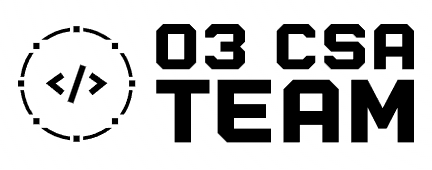

1) Câu chuyện dữ liệu: Trung Kiên
2) Pandas & Streamlit: Như Đăng - Thanh - Trung Kiên
3) Review code: Thanh

- Câu hỏi trong câu chuyện dữ liệu:

+ Cơ bản: 
Mỗi môn có bao nhiêu thí sinh thi? DONE
Trung bình điểm mỗi môn là bao nhiêu? DONE
Có bao nhiêu bạn đạt điểm tuyệt đối (10.0)?
Có bao nhiêu bạn bị điểm liệt (dưới 1.0)?
Phổ điểm mỗi môn có phân bố đều không?
Môn nào là “ác mộng” của thí sinh?

Môn nào có độ chênh lệch điểm lớn nhất?
Môn nào có tỷ lệ điểm liệt cao nhất?
Tổ hợp KHTN hay KHXH được chọn nhiều hơn?
Tổ hợp nào có điểm trung bình cao hơn?
Tổng điểm xét tuyển của thí sinh phân bố ra sao?
Bao nhiêu bạn đạt từ 24+ điểm? Từ 27+? Ai gần 30 điểm?
Có thí sinh nào điểm cực thấp ở cả 9 môn không?
Điểm trung bình cao nhất, thấp nhất là bao nhiêu?
Học sinh nào có điểm trung bình cao nhất?
Có bao nhiêu học sinh có điểm trung bình trên 8? (vẽ biểu đồ cột số lượng theo từng mức điểm)

Học sinh nào có điểm trung bình cao nhất và thấp nhất? (hiển thị tên hoặc số báo danh trên biểu đồ)
Phân tích số lượng học sinh đạt điểm dưới trung bình (<5) ở từng môn.
So sánh điểm trung bình giữa học sinh tham gia học thêm theo số giờ học thêm (nếu có dữ liệu).
Tỷ lệ phần trăm học sinh đạt điểm giỏi theo từng môn.
Lọc ra danh sách học sinh có điểm môn Anh dưới 4 và vẽ biểu đồ biểu thị tình trạng này.
Vẽ biểu đồ heatmap thể hiện ma trận tương quan giữa các môn thi.

